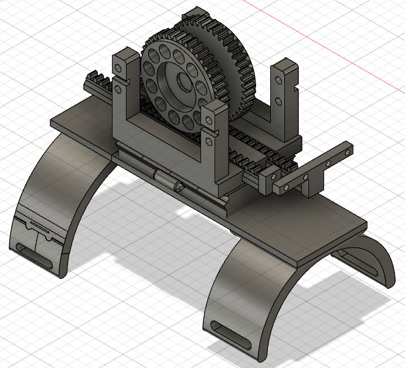
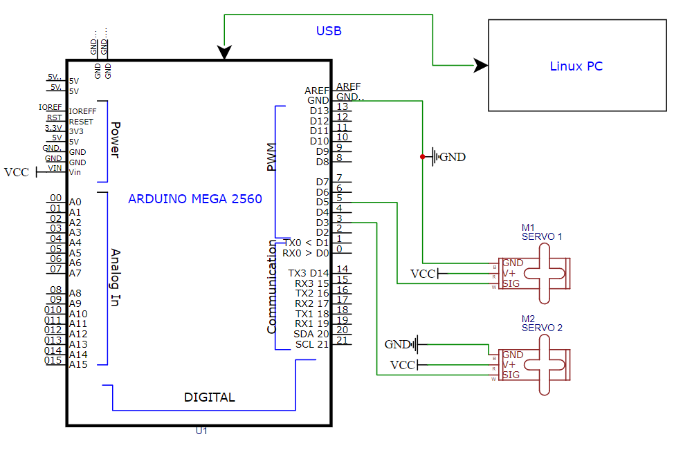
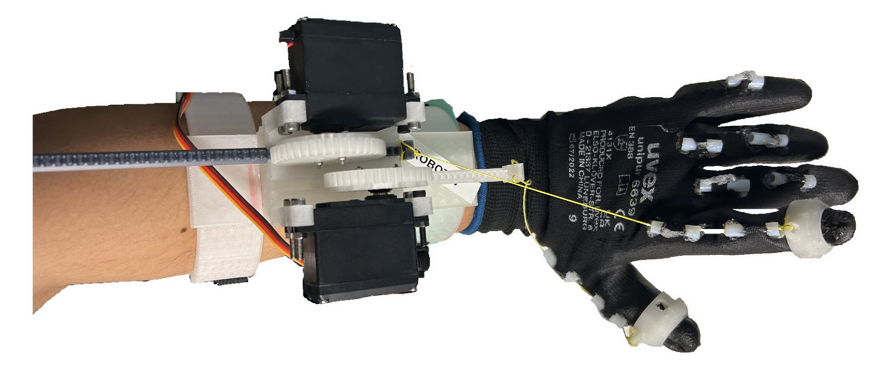
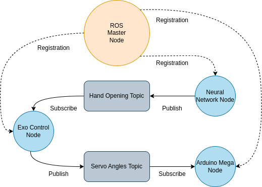
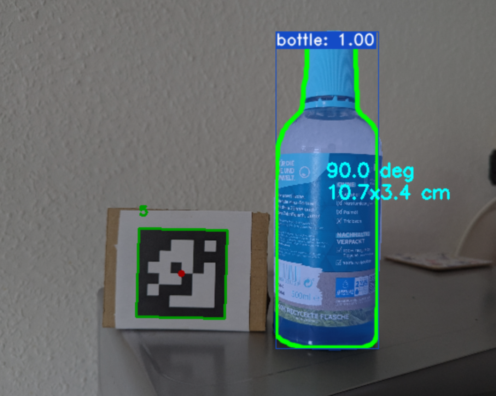

# Convolutional Neural Network Based Soft-Exoskeleton for Stroke Patient Rehabilitation

The aim of this paper is to implement and test a prototype of a hand soft-exoskeleton. It would help the stroke spastic patients, with the hand fixedly closed, to open their hand. This soft-exoskeleton will also be incorporated with a CNN computer vision system for detecting the desired object to interact with and help the hand reach this specific aperture. With this, we intend to assist the patients not only in daily activities but also in rehabilitation, looking forward to have neuronal plasticity help the patients recover hand dexterity and require each time less assistance.

## ROS Control

 
Run in different terminals after connecting Arduino with USB cable:
<pre>
roscore
</pre>
<pre>  
cd exo_ws
</pre> 
<pre>  
rosrun rosserial_python serial_node.py /dev/ttyACM0
</pre>
<pre> 
rosrun servo_control publisher.py
</pre> 
 
 

### CNN Detection and Object measurement.

Launch Neural Net Node:
<pre> 
cd ./YOLACT-mini-Instance-segmentation
python3 detect_measure_ros_pub.py
</pre> 
